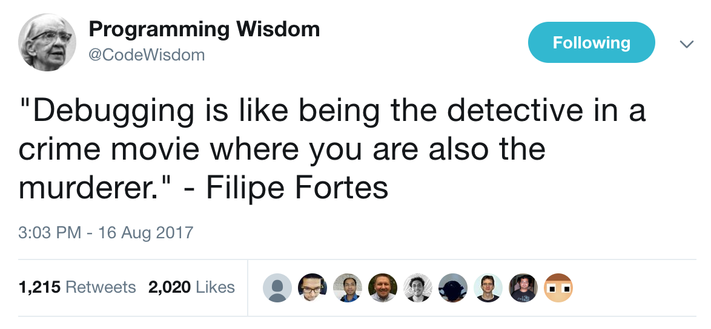
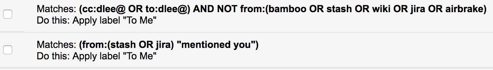
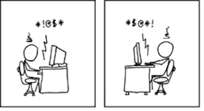
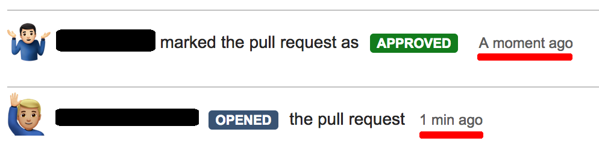
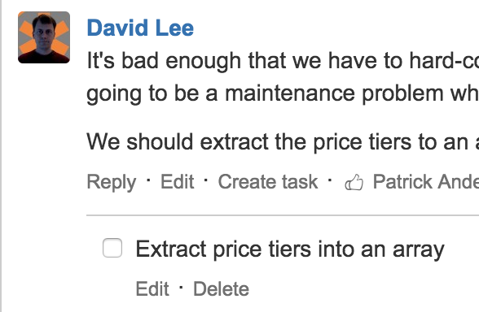
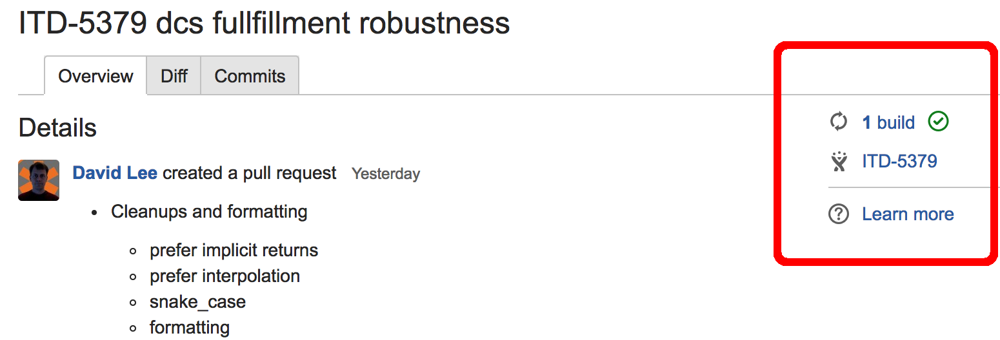
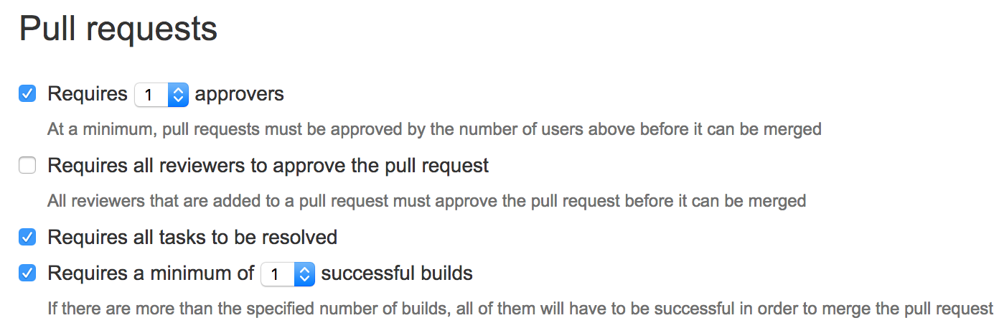
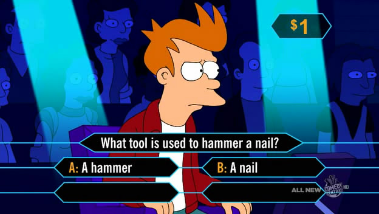

<!-- Written with Marp: https://yhatt.github.io/marp/ -->
<!-- $theme: default -->

# Effective Code Reviews

> Code that actually gets reviewed, and feedback that's actually helpful

<small>David M. Lee, II
[@leedm777](https://github.com/leedm777) GitHub
[@leedm777](https://twitter.com/leedm777) Twitter
[leedm777@yahoo.com](mailto:leedm777@yahoo.com)</small>

---

# Why Code Review?

* One of the most [cost effective ways to find defects][Code Complete]\[1]
* Finds non-defect coding issues (maintainability, readability)
* Promotes current best practices
* Educational for all involved

<small>[1]: *[Code Complete][]*, chapter 20</small>


---

# Tools help, but aren't necessary

You can make `git format-patch`/`svn diff` + email work

---

# Rules for effective submissions

### “Look, that's why there's rules, understand? So that you think before you break 'em.” – Terry Pratchett

---

# Post small reviews

* Reviewer effectiveness drops off >400 LOC
* Be respectful of the reviewer's time


<small>Chart from [SmartBear][]</small>

---

# Post even smaller commits

* Don't lump several different changes into a single commit
  * Put style/formatting changes into a different commit
  * Break up into logical commits (things you fix along the way, vs. the intent of your submission)
* `git rebase` and `git commit --fixup` is your friend

---

# Write good commit messages

Commit history is the guide to why the code is the way it is.

[](https://twitter.com/CodeWisdom/status/897911593878511617)

---

#  [How to Write a Git Commit Message][git-commit] 

From Chris Beams:
 1. Separate subject from body with a blank line
 2. Limit the subject line to 50 characters
 3. Capitalize the subject line
 4. Do not end the subject line with a period
 5. Use the imperative mood in the subject line
 6. Wrap the body at 72 characters
 7. Use the body to explain *what* and *why* vs. *how*


---

# Use the imperative mood in the subject line

* “spoken or written as if giving a command or instruction”
* Examples (again, from Chris Beams)
  * Refactor subsystem X for readability
  * Update getting started documentation
  * Remove deprecated methods
  * Release version 1.0.0
* Should complete the sentence “If applied, this commit will {{subject-line}}.”

---

# Use the body to explain *what* and *why* vs. *how*

* *how* is either implicit in your code, or belongs in code comments
* *what* and *why* provide context; gives reasons for the change
  * What did the code do before the change?
  * Include references to relevant issues in issue tracker
    * Tooling can link commits/builds/issues

---

# *how* is at best useless, or at worst misleading

```diff
commit 6ab909cdb8426c3c05c8ee253bd5002a77f3172b (HEAD -> throw-away)
Author: David M. Lee <leedm777@yahoo.com>
Date:   Wed Aug 16 13:44:32 2017 -0500

    Add 7 to x instead of 5

diff --git a/foo.js b/foo.js
index 50be92d2..a4ab74ed 100644
--- a/foo.js
+++ b/foo.js
@@ -1 +1 @@
-x = x + 5;
+x = x + 6;
```

---

# *why* is actually helpful

```diff
commit 8c5bc990de82b9c5ec910e582643a9cd9c407bbf (HEAD -> throw-away)
Author: David M. Lee <leedm777@yahoo.com>
Date:   Wed Aug 16 13:44:32 2017 -0500

    Increase timeout increment
    
    When we need to bump up our timeouts (sadly in a variable named `x`), we
    weren't increasing it quite enough to account for slowness of WAN traffic.
    
    See XYZ-8373

diff --git a/foo.js b/foo.js
index 50be92d2..a4ab74ed 100644
--- a/foo.js
+++ b/foo.js
@@ -1 +1 @@
-x = x + 5;
+x = x + 6;
```

---

# Bitbucket/GitHub: Use mentions to get someone's attention

* Some of us get too many emails to reasonably handle

* Mentions help us filter signal from noise


---

# Rules for effective reviewing

### “more what you'd call 'guidelines' than actual rules”

---

# Be polite



"It's easier to be an asshole to words than to people." - Randall Munroe, [XKCD #438][internet_argument]

---

# Take your time; take frequent breaks

* Don't spend more than an hour at a time code reviewing
* Spend the time to properly understand and review the code


---

# Don't blindly approve changes



* If you don't want to review, just remove yourself from it
* If you're not familiar enough to give it a :+1:, just leave feedback and leave it unapproved

---

# BitBucket: Use tasks to require a follow-up



---

# Rules for effective tooling


---

# Integrate CI tools with code review

* Humans can focus on just reading the code
  * Let the bots run the tests and linters 



---

# Bitbucket: Set minimum criteria for merging


* Don't overdo it; if it's too much trouble devs will find a way to avoid it

---

# Bitbucket: Set default reviewers for your repos

No one should ever miss a PR.

---

# Questions?



---

# References


* [Code Complete: A Practical Handbook of Software Construction][Code Complete], Steve McConnell
* [Best Practices for Code Review][SmartBear], SmartBear
* [How to Write a Git Commit Message][git-commit], Chris Beams
* [XKCD-438][internet_argument], Randall Munroe
* Futurama, Matt Groening

 [Code Complete]: http://a.co/2jBAjQw
 [SmartBear]: https://smartbear.com/learn/code-review/best-practices-for-peer-code-review/
 [git-commit]: https://chris.beams.io/posts/git-commit/
 [internet_argument]: https://xkcd.com/438/